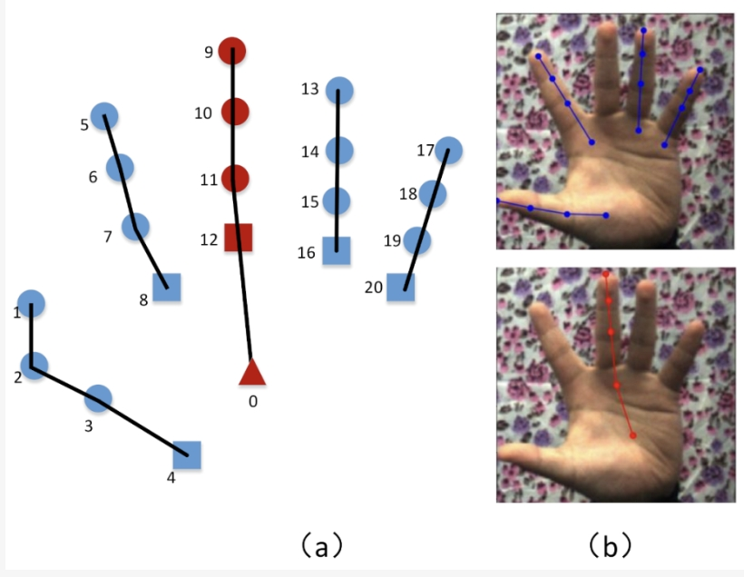
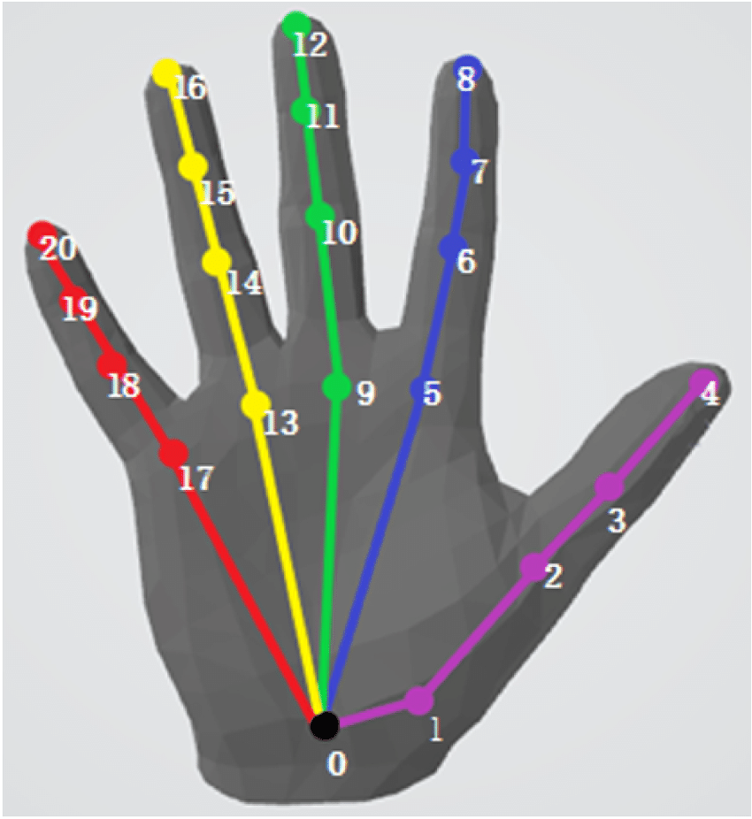

# DenoisingDiffusion3DHandPoseEstimation
This is the implementation code for the paper titled ["Denoising Diffusion for 3D Hand Pose Estimation from Images"](https://arxiv.org/abs/2308.09523).

<!-- 
## Install library packages
```pip install -r requirements.txt``` -->


## Parameter setting
All parameters are configured in ```config/config.py```. This includes settings such as batch size, the input channel of the network, etc.

## Dataset
Currently, only a data loader for RHD dataset is impletemented.
To use the RHD dataset, specify the data directory and the dataset name ```dataset_root_dir``` and ```dataset_name``` in ```config/config.py```, respectively.
### RHD
Joint order in RHD is as follows:



## Network
The network comprises various elementary modules, including conditional diffusion, a forward kinematic layer, and a ResNet feature extractor, etc.
They are located in ```network/sub_modules```.
The global network architecture is impletemented in ```network/diffusion3DHandPoseEstimation.py```.


## Loss function
All loss functions are implemented in ```criterions/loss.py```. The loss function specific to the diffusion model is included in its module ```network/sub_modules/conditionalDiffusion.py```. The computation considers only the visible points.

## Metrics (MPJPE)
The metric MPJPE (Mean Per Joint Position Error) is implemented in  ```criterions/metric.py```, and it also accounts for only the visible points.

## Training and Validation
Training and validation processes are implemented in ```wroker.py```. For debugging purposes, you can set the input variable ```fast_debug``` of the ```trainval function``` to ```True```.

## MANO
Joint order in MANO is as follows:



## Relative References
[contra-hand](https://github.com/lmb-freiburg/contra-hand/tree/main)

[obman_train](https://github.com/hassony2/obman_train/tree/master)

[manopth](https://github.com/hassony2/manopth)

[MANO](https://github.com/otaheri/MANO)

[Minimal-Hand-pytorch](https://github.com/MengHao666/Minimal-Hand-pytorch/tree/main)

[hand3d](https://github.com/lmb-freiburg/hand3d)

[3dhand](https://github.com/boukhayma/3dhand)

[3D-Hand-Pose-Estimation](https://github.com/OlgaChernytska/3D-Hand-Pose-Estimation)
